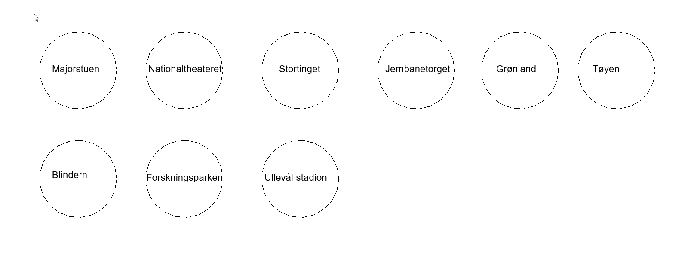

# Oppgave 4
Jeg begynte først med å tegne opp grafen for å ha en ryddig oversikt:


Bygget så en ferdig naboliste og traverserte denne.
Slet en del med resten av oppgaven før det løsnet. Se KI bruk.

## Forklaringer
### Tidskompleksiteten O(V + E)
Tidskompleksiteten O(V + E) gjelder blant for traversing av nabo liste (adjacency list) med BFS. 
V står for vertices(nodene) mens E står for edges (kanter).

Vi får O(V + E) siden:
* O(V): hver node er besøkt en gang
* O(E): hver nabo ligger på en kant og blir besøkt en gang
* Kombinert gir det O(V+E)

### FIFO rekkefølge korteste antall stopp
FIFO står for Fist In First Out og er et kjennetegn for BFS grafer.
FIFO rekkefølge gir korteste vei siden vi alltid besøker dem nærmeste nodene først under traverseringen.
Eller sakt på en annen måte: noder bahandles nivå for nivå og vi kan dermed finne den stien med færrest antell kanter mellom start - og målnode.

### Returverdi ingen rute for GetShortestPath
Jeg har valgt å returnere -1 om det ikke finnes noen rute. Da kan man enkelt bruke denne verdien for å gi beskjed til bruker om at det ikke finnes rute.


## KI bruk
Prompt: 
Holder på med BFS for en graf med et endepunkt uten naboer. Får KeyNotFoundException for endepunktet. 
Hvordan kan man unngå det. Svar veldig kort.

Svar: 
Bruk TryGetValue i stedet for indekseringsoperatoren:
```C#
if (graph.TryGetValue(node, out var naboer))
{
    foreach (var n in naboer) { /* ... */ }
}
```
Alternativt: sørg for at hver node får en tom liste når du bygger grafen, så finnes nøkkelen alltid. 
Det er som regel den reneste løsningen.

Slet veldig med med: 
"Implementer void AddConnection(string stationA, string stationB)". 
Etter å ha holdt på noen timer med å prøve å forstå hvordan det skulle angripes, fant jeg ut at jeg hadde noen kunnskapshull
knyttet til hvordan man lager toveisforbindelse mellom to noder samt hvordan man finner korteste vei mellom to noder. 
Videre så jeg videre på oppgave 5 der man skal undersøke om det finnes en rute mellom to noder og oppdage syklus i urettede graf.
Hadde ingen erfaring med dette. Kunne kun traversering av grafer.
Har tidligere god erfaring å la Claude lage pedagogisk opplegg til meg så jeg promptet:

Prompt:
Lag et pedagogisk opplegg som lærer meg følgende om grafer i c#:

For BFS
* Hvordan man kan legge til toveisforbindelse mellom to noder med metode:  void AddConnection(string nodeA, string nodeB).
* Finner korteste vei mellom to noder.

For DFS
* Undersøke om det finnes en rute mellom to noder
* Oppdage syklus i urettede graf

Lag pedagogsike forlaringer og kode som er puggbar slik at alle konseptene sitter.
Kan traversering fra før av. Lag PDF.

Brukte deretter KI en del for å utdype forkllaringene i PDFen.

Svar:
Se vedlagt PDF

## Kode
```C#
public class BFSGraph
{
    // Egenskaper

    public Dictionary<string, List<string>> _adj = new();

    public IEnumerable<string> Nodes => _adj.Keys;

    public void AddNode(string node)
    {
        _adj.TryAdd(node, new List<string>());
    }


    // Metoder

    // Metode for å binde to noder til hveranre i en urettet graf
    public void AddConnection(string nodeA, string nodeB)
    {
        // Legger til nodene som keys
        AddNode(nodeA);
        AddNode(nodeB);

        // Node B legges til node A sin naboliste
        _adj[nodeA].Add(nodeB);

        // Node A legges til node B sin naboliste
        _adj[nodeB].Add(nodeA);
    }


    // Metode for å returnere naboliste for en node
    public IReadOnlyList<string> Neighbors(string node)
    {
        if (_adj.TryGetValue(node, out var list))
        {
            return list;
        }
        // Om node ikke finnes returneres tom liste
        return new List<string> { };
    }


    public List<string> TraverseBFS(Dictionary<string, List<string>> graph, string start)
    {
        var visited = new HashSet<string>() { start };
        var order = new List<string>();

        var queue = new Queue<string>();
        queue.Enqueue(start);

        while (queue.Count > 0)
        {
            var node = queue.Dequeue();
            order.Add(node);


            if (graph.TryGetValue(node, out var neighbors))
            {
                foreach (var neighbor in neighbors)
                {
                    if (visited.Contains(neighbor))
                    {
                        continue;
                    }
                    visited.Add(neighbor);
                    queue.Enqueue(neighbor);
                }
            }
                              
        }
        return order;
    }


    public int GetShortestPath(string start, string goal)
    {
        if (start == goal)
        {
            throw new ArgumentException("Start and end node must be diffrent");
        }

        var visited = new HashSet<string>() { start };
        var parent = new Dictionary<string, string>();
        var queue = new Queue<string>();

        queue.Enqueue(start);

        while (queue.Count > 0)
        {
            var node = queue.Dequeue();
            visited.Add(node);

            if (node == goal)
            {
                // Når noden vi har tatt ut er lik målet vårt (node 2)
                // Bygger vi en liste bakover med med metoden GoBack()
                var pathList = GoBack(start, goal, parent);

                // Vi returnerer antallet elementer i listen - 1 for å få nodeavstanden
                return pathList.Count() - 1;
            }

            foreach (var neighbor in Neighbors(node))
            {
                if (!visited.Contains(neighbor))
                {
                    // Nodebarn legges som nøkkel, forelder som verdi
                    // En foreldre (node) kan ha flere barn (neighbors)
                    parent[neighbor] = node;

                    visited.Add(neighbor);
                    queue.Enqueue(neighbor);
                }
            }
        }
        // Returnerer 0 om goal aldri blir funnet. Det er i så fall ingen sti mellom nodene.
        return 0;
    }

    public List<string> GoBack(string start, string goal, Dictionary<string, string> parent)
    {
        var order = new List<string>();

        // Omgjøring av navn for mer pedagogisk variabelnavn 
        string node = goal;

        // Vi rygger bakover
        while (node != start)
        {
            order.Add(node);

            // Flytter et steg bakover til forelderen til noden
            // Hvert barn har bare en forelder
            node = parent[node];
        }

        // Start legges til slutten av listen
        order.Add(start);

        // Listen reverseres for å få riktig rekkefølge
        order.Reverse();

        return order;
    }


    // Metode ikke i bruk. Brukt for å teste traversering.
    public Dictionary<string, List<string>> BuildTestGraph()
    {
        var testGraph = new Dictionary<string, List<string>>
        {
            ["Majorstuen"] = new() { "Nationaltheatret", "Blindern" },
            ["Nationaltheatret"] = new() { "Stortinget", "Majorstuen" },
            ["Stortinget"] = new() { "Jernbanetorget", "Nationaltheatret" },
            ["Jernbanetorget"] = new() { "Grønland", "Stortinget" },
            ["Grønland"] = new() { "Tøyen", "Jernbanetorget" },
            ["Majorstuen"] = new() { "Blindern", "Nationaltheatret" },
            ["Blindern"] = new() { "Forskningsparken", "Majorstuen" },
            ["Forskningsparken"] = new() { "Ullevål stadion", "Blindern" },
            ["Ullevål stadion"] = new() { "Forskningsparken" }
        };

        return testGraph;
    }


}
```

## Tester
```
public class TestOppgave4
{

    [Fact]
    public void TraverseBFS_Majorstuen_ShouldReturnSpesificOrder()
    {
        // Arrange
        var graph = new BFSGraph();
        var graphHelper = new MenuOppgave4(graph);

        var expectedOrder = new List<string>
        {"Majorstuen", "Nationaltheatret", "Blindern", "Stortinget", "Forskningsparken",
            "Jernbanetorget", "Ullevål stadion", "Grønland", "Tøyen"};

        graphHelper.BuildGraph();

        // Act
        var actualOrder = graph.TraverseBFS(graph._adj, "Majorstuen");


        // Assert
        Assert.Equal(expectedOrder, actualOrder);
    }

        
    [Fact]
    public void TraverseBFS_AddingIsolatedNode_ShouldContain1()
    {
        // Arrange
        var graph = new BFSGraph();
        var graphHelper = new MenuOppgave4(graph);

        graphHelper.BuildGraph();
        graph.AddNode("NewStation");

        // Act
        var order = graph.TraverseBFS(graph._adj, "NewStation");
          
        // Assert
        Assert.Single(order);
    }

    [Fact]
    // This test checks that adding a isolated node will not connect the isolated node to the rest of the graph
    public void TraversBFS_AddingIsolatedNode_TraversingExistingShouldStillContain9()
    {
        // Arrange
        var graph = new BFSGraph();
        var graphHelper = new MenuOppgave4(graph);

        graphHelper.BuildGraph();
        graph.AddNode("NewStation");

        // Act
        // Traversing the part of the graph co
        var order = graph.TraverseBFS(graph._adj, "Tøyen");


        // Assert
        // There are 10 nodes in total. 9 of them (including Tøyen) is connected
        Assert.Equal(9, order.Count());
    }

    [Fact]
    public void GetShortestPath_CheckMissingPathMajorstuenToNyNode_ShouldReturn0()
    {
        // Arrange
        var graph = new BFSGraph();
        var graphHelper = new MenuOppgave4(graph);

        graphHelper.BuildGraph();
        graph.AddNode("NewStation");

        // Act
        var shortestPath = graph.GetShortestPath("Majorstuen", "NewStation");

        // Assert
        Assert.Equal(0, shortestPath);
            
    }

    Fact]
    public void GetShortestPath_MajorstuenToGrønland()
    {
        // Arrange
        var graph = new BFSGraph();
        var graphHelper = new MenuOppgave4(graph);

        graphHelper.BuildGraph();

        // Act
        var shortestPath = graph.GetShortestPath("Majorstuen", "Grønland");

        // Assert
        Assert.Equal(4, shortestPath);
    }

    [Fact]
    public void GetShortestPath_UllevålToTøyen()
    {
        // Arrange
        var graph = new BFSGraph();
        var graphHelper = new MenuOppgave4(graph);

        graphHelper.BuildGraph();

        // Act
        var shortestPath = graph.GetShortestPath("Ullevål stadion", "Tøyen");

        // Assert
        Assert.Equal(8, shortestPath);
    }
}
```