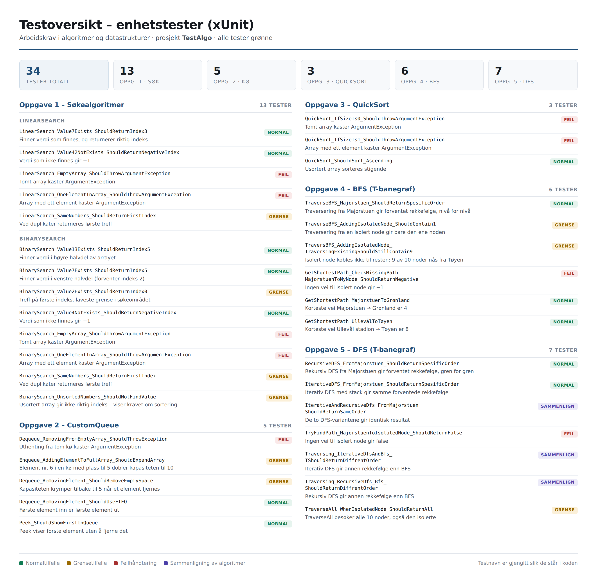

# Informasjon
* Utvikler: Kristian Spikkeland
* Utviklet i: Visual Studio
* Om: Arbeidskrav algoritmer Gokstad Akademiet
* Lenke Github: https://github.com/kristianSpikkeland/Arbeidskrav-1-Algoritmer.git
* Lenke til videopresentasjon: https://fagskoleniagder.cloud.panopto.eu/Panopto/Pages/Viewer.aspx?id=7ddec794-198a-4599-b445-b4cd00e0543c&start=0

## Kjøring
Programmet kjøres med play knappen. Utforming på denne avhengiger av kodeeditor.
Alternativt kan man bruke terminalen: 
```txt
dotnet run --project KodeAlgo
```
Det er satt opp et eget testprosjekt. Xunit er brukt som et ekstra rammeverk for tester.
Høyreklikk på testprosjekt med navn TestAlgo og velg Run Tests.
Alternativt i terminal: 
```txt
dotnet test 
```

# KI 
## Generelt 
Litt spørsmål rundt plassering av .gitignore fil.
Videre spurte man om navngivning av tester.
Videre har man brukt KI noe for å sjekke logiske feil samt enkel debugging. 
Men har forsøkt å holde det på et lavt nivå og dokumentere ihht. krav.

Noen spørsmål knyttet til oversetting fra norsk til engelsk.
Litt kodeforklaringer knyttet til Youtube videoer jeg har sett.
Fikk forklart en del rundt plasskompleksitet. Samt forskjellen mellom tid- og plasskompleksitet.
Videre fikk man forklart hva basisteg og rekrusivt steg er og hva forskjellen er mellom dem.
Noen enkle spørsmål knyttet til markdown fil.
Samt noen spørsmål rundt oppgaveforståelse.
Lastet opp testene mine og fikk Claude til å lage en oversikt. 

## Kvalitetssikring
Da man regnet seg ferdig kjørte man denne prompten:
Da mener jeg at arbeidskravet er ferdig og at kun videoinnspilling gjenstår. 
Gå gjennom besvarelsen og finn kun dem viktigste manglene/feilene i forhold til oppgaveteksten. 
Tre PDF side er maks og sorter per oppgave. Det skal være høy terskel for å regne noe som feil. Vær pedagogsik slik at jeg skjønner hvorfor det er feil.

Svaret ligger vedlagt i vedlegs mappen med navn: Gjennomgang-Arbeidskrav1.pdf 

## Refleksjon
Det har vært et lærerikt prosjekt. Jeg vil si at det har vært det prosjektet der hvor man har lagt ned mest timer til nå. Totalt sett har det blitt en del KI bruk,
men det har vært nødvendig da mye var nytt for meg. Samtidig har man øvt en del på algoritmer + Balzor i sommer, så man har fått implementert en god del egen kode også.
Liker godt å få Claude til å lage undervisningsopplegg og komme med kodeeksempler på ting man ikke har vært borti før. Litt varierende grad av mengde kodekommentarer.
Men har forsøkt å fremheve det jeg mener er viktig. Og kode som ikke sitter like bra i eget hode, har man lagt til ekstra kommentarer for å enklere forstå kodebasen.

## Andre kilder
### Komme igang
https://www.youtube.com/watch?v=VXSqNCso3fA
https://docs.github.com/en/repositories/creating-and-managing-repositories/cloning-a-repository

### Oppgave 2
https://www.youtube.com/watch?v=aNTDJ9bnRU4
https://www.youtube.com/watch?v=HABx2vP-Ee0

### Oppgave 3
https://www.youtube.com/watch?v=MZaf_9IZCrc
https://www.geeksforgeeks.org/dsa/time-and-space-complexity-analysis-of-quick-sort/
https://www.geeksforgeeks.org/dsa/quick-sort-algorithm/

### Oppgave 4
https://singhajit.com/data-structures/graph/

### Testoversikt generert av KI (Claude)


